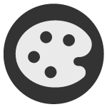

# (3.0) Design and Development (Privacy)

##  Privacy by Design

Integrate privacy measures from the start. Not only when privacy risks arise. If the user or beneficiary does nothing, their privacy is protected. Consider privacy as meaningful boundary management.

R**emember**, If the user does nothing, their use of your product is still secure. And privacy is anti-surveillance by design!

How to focus on creating design prototypes and developing the project infrastructure:

###  Data Minimisation

* **Key actions**
  * **Only collect** the amount and types of data you need. This means the absolute minimum amount of data necessary. Remember, more data does not always translate to better.
  * Ensure that you only **use** the data collected for the purpose you and the user or beneficiary agreed on.

###  Good Data Retention Practices

* Key actions
  * Do not keep the data longer than needed for the purposes you and the user and/beneficary agreed to. That is, delete data you no longer need, after a specific period of time or when requested to do so by the user.

###  Disclosure and Data Sharing

* **Key actions**
  * **Do not disclose** any data unless necessary **to achieve the purpose it was collected**. Where purpose has been agreed on by users or beneficiaries.

###  Positive Sum

* **Key actions**
  * Provide full product functionality, from user experience to security. For example, a cryptpad provides functional collaborative documents, and privacy. Calyx has an android OS and Mobile internet service that is fully functional with no “trade offs”. Signal provides you with a messaging platform that centers on privacy in a functional way.
*   **Tip**

    The goal is to minimize threats, and ensure sustainability.

###  End to End Encryption

* **Key actions**
  * Create in-built end-to-end-security, and protection: encrypt the full lifecycle of data in motion and at rest. Make sure it remains confidential, true to its original form and accessible. Encryption also protects to user or beneficiary from third-party spying.
*   **Tip**

    **Privacy by Design** cannot be a random feature on a product. It must be a practice where any new process or decision must be tested through a privacy-first mindset.
*   **Another note**

    Many people may find it useful to have additional protections through the use of VPNs and other surveillance circumvention technologies, your product should be built to support some of these features, and personal practices, **not block it**, which puts folks at risk.

### &#x20;Lets Do an Exercise

*   **Simple Scenario**

    You need to collect data for a research project you are undertaking to improve access to libraries in a community. You and your team decide to use a form to collect information from residents. From the 7-step approach we have provided how will you embed privacy by design in your decisions, rolling out the forms and using the data?
* **Action**
  *   **What form provides better privacy**

      Using FormStack or JotForm may provide better privacy than say google form.
  *   **How might we collect the necessary information only**

      You do not need personal information, like emails or names of the people you speak to. You only need them to answer specific questions on how the community library can be improved to work better for them. You should only collect their contact details if you need to contact them. But privacy is better protected if you never collect the information or data in the first place.
  *   **What is our data retention period?**

      If you ever need to contact them, then only keep that information on a Cryptpad sheet, and set a self destruct timer. The sheet will also be password protected. However, for research standards it is required that you keep data for up to 3 years after collection and deleting it thereafter. However you and your team can set your own data retention period.
  *   **How can we only distribute information to the team that needs it?**

      Only share the information that is needed to a specific team. For example, instead of sharing the spreadsheet as “anyone with link or on web can access”, add the specific persons who need to be involved directly to the document. Remove their access after their tasks is done. And in the case you may need to share some data externally for verification, extract the exact data needed into another spreadsheet, or which ever format needed, and share it with with the people who it concerns. Remove access after their task is completed.
*   **Tip**

    Given that some people may create copies of the document, it may be important to disable certain replicable features when sharing data externally. Remember that it must only be used for the purpose it was stated to the users and beneficiaries in the first place.
*   **Something to Consider**

    Many data scientists and designers are wrangling between preserving privacy by not collecting certain identity data however risk their data being exclusive to a dominant group because of the cost of engagement. Other times not collecting disaggregated data, also means data on minority groups may not exist to trace challenges, biases and issues the community is facing. Still collecting the data may lead to targeting using said proxy factors. **How might we balance out anonymity, and the social impact of diversified datasets?**

***

### **The Importance of MVPs and User Feedback**

Part of the OCL methodology is to deploy MVPs and improve based on direct user feedback.

**When considering potential harm, it is important to ask**:

”Is this an MVP-safe” idea? In other words, is there a scenario where an insufficiently developed product launched too widely can do more harm than the value of gathering feedback?

***

### **Case study: Public Scrutiny of Contact Tracing Apps**

During the COVID-19 pandemic, when urgency was highly valued, several governments proposed contact tracing apps to monitor virus spread. Public and expert feedback highlighted privacy concerns, leading to the adoption of more privacy-preserving approaches in many jurisdictions. For example, some apps shifted to **decentralized models,** where data processing occurs on individual devices rather than **centralized servers**, **minimizing data privacy risks**.
